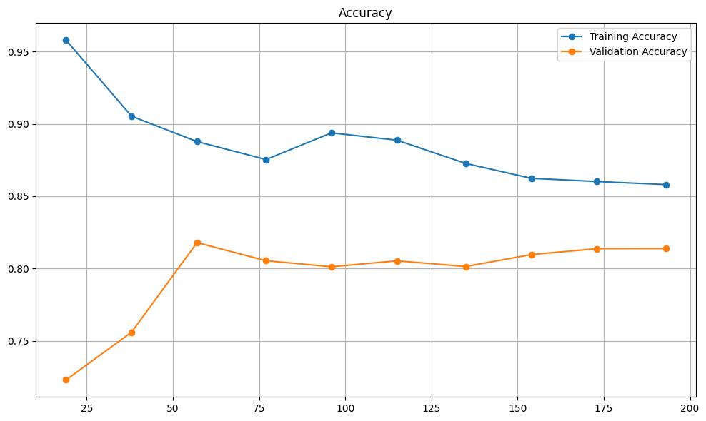
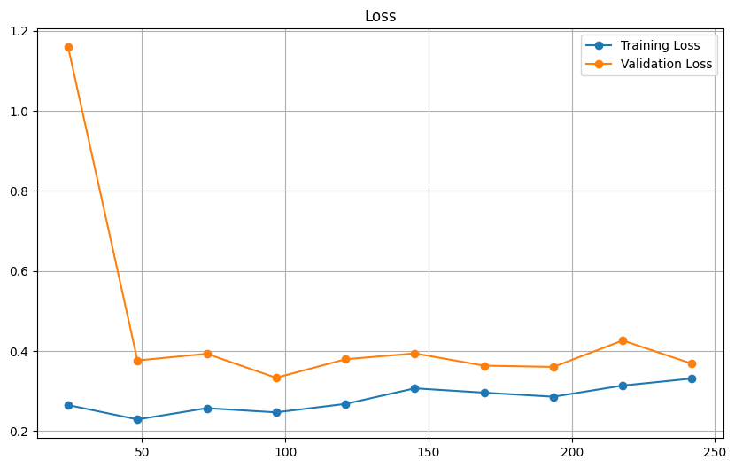

# ❤️ Heart Disease Prediction with Machine Learning

Hi there! 👋  
This project is a simple and practical machine learning solution to predict whether a person is at risk of heart disease, using basic health-related input features. I built this project as part of my learning journey in data science and ML — and also because solving real-world health problems with technology is fascinating!

---

## 🩺 Why This Project?

Heart disease is one of the leading causes of death worldwide. But what if we could use machine learning to identify potential risk early — using just some basic medical data? That’s the idea here.

This model takes input like age, blood pressure, cholesterol levels, etc., and predicts whether a person is likely to have heart disease.

---

## 📊 Dataset Overview

The dataset used contains several medical parameters for patients. Here are the features:

- `age`: Age of the person
- `sex`: Gender (0 = female, 1 = male)
- `cp`: Chest pain type (0–3)
- `trestbps`: Resting blood pressure
- `chol`: Serum cholesterol in mg/dl
- `fbs`: Fasting blood sugar > 120 mg/dl (1 = true; 0 = false)
- `restecg`: Resting electrocardiographic results
- `thalach`: Maximum heart rate achieved
- `exang`: Exercise induced angina
- `oldpeak`: ST depression induced by exercise
- `slope`: Slope of the peak exercise ST segment
- `ca`: Number of major vessels (0–3)
- `thal`: Thalassemia type
- `target`: 1 = has heart disease, 0 = no heart disease ✅

---

## 🛠 Tech Stack

Built using:

- Python 🐍
- NumPy, Pandas for data handling
- Seaborn & Matplotlib for visualizations
- Scikit-learn for building the ML model
- Gradio for an interactive web interface (try it out!)

---

## 🧠 Model Summary

I used a **Logistic Regression** model — simple, fast, and interpretable — which turned out to work really well for this binary classification task.

- 📈 **Accuracy**: ~85%
- 📊 Evaluated using: confusion matrix, classification report, log loss

---

## 📈 Accuracy vs Training Size



## 📉 Loss (Log Loss) vs Training Size




## 🚀 Getting Started

To try out the project on your own system, follow these steps:

### 1. Clone the repository
```bash
git clone https://github.com/raj-dhawaniya/heart_disease_prediction_model.git
